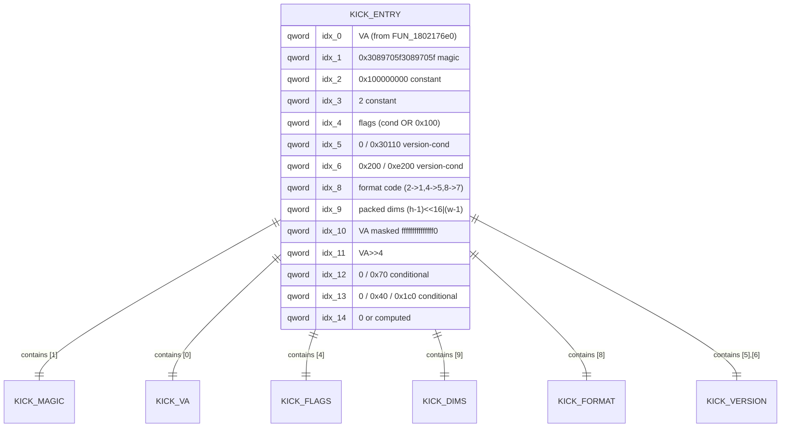
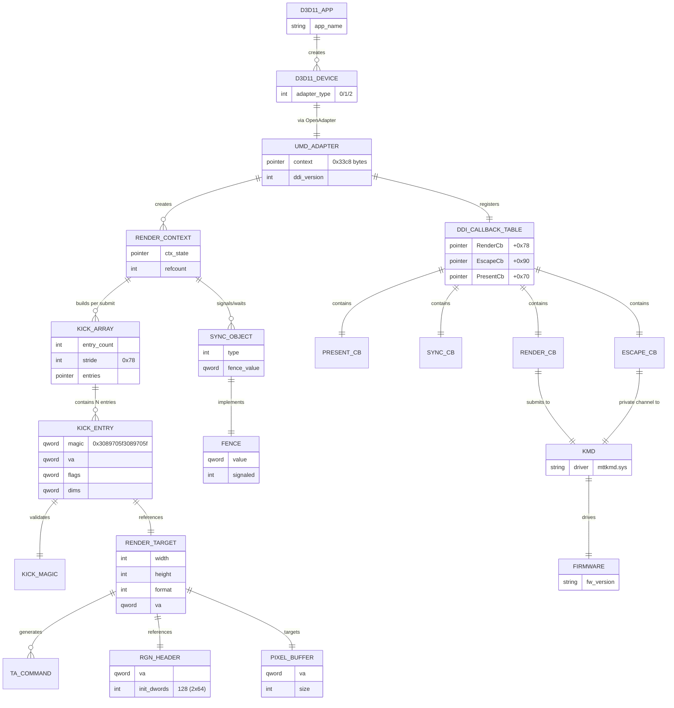

# r460：Windows 驱动 TA 提交流程图/ER 图——D3D11 0x78B kick 路径基准

**结论：Windows mtdxum64.dll 走 D3D11 DDI 模型，经 D3DDDI 回调提交 0x78 字节 kick 数组（magic 0x3089705f3089705f），与 Linux 的 360B Header 是两套不同的提交抽象，但底层都指向同一固件。流程图与 ER 图已建立，为 Linux 路径对比提供基准。**

## 1. 反编译来源

- 文件：`mt-vgpu-guest/decompiled/mtdxum64.dll/decompiled.c`（16MB，7911 函数，Ghidra 12.1.4）
- 导出函数（4 个）：`MtDxExtGetInterfaceImpl`、`OpenAdapter`、`OpenAdapter10`、`OpenAdapter10_2`
- 调用图：`calls.jsonl`（7640 条边）

## 2. TA 提交流程图

```mermaid
flowchart TD
    A[D3D11 App<br/>Draw/Present] --> B[D3D11 Runtime]
    B --> C[UMD DDI Dispatch<br/>mtdxum64.dll]
    C --> D{OpenAdapter<br/>variant?}
    D -->|0| E[OpenAdapter<br/>FUN_180001630 type=0]
    D -->|1| F[OpenAdapter10<br/>FUN_180001630 type=1]
    D -->|2| G[OpenAdapter10_2<br/>FUN_180001630 type=2]
    E --> H[Adapter Init<br/>D3DDDI Callback Table]
    F --> H
    G --> H
    H --> I[Register Callbacks<br/>via mockx64.dll GetProcAddress]
    I --> J[D3DDDIRenderCb<br/>D3DDDIEscapeCb<br/>D3DDDIPresentCb<br/>Sync Object Cbs...]
    J --> K[Render Context<br/>Created]
    K --> L[Draw Call<br/>Accumulate State]
    L --> M{FUN_18021cf50<br/>Kick Array Builder}
    M --> N[State Sync<br/>0xa278/0x9cd0 swap]
    N --> O[Per-Entry Loop]
    O --> P[FUN_180224220<br/>0x78B Kick Builder]
    P --> Q[Kick Entry 15 qwords<br/>magic at [1]]
    Q --> O
    O --> R{FUN_180224440<br/>Submit Prep}
    R --> S[KMD Callback<br/>offset 0xc28<br/>Render/Escape]
    S --> T[Windows KMD<br/>mttkmd.sys]
    T --> U[GPU Firmware<br/>TA Execute]
    U --> V[Fence Signal<br/>Completion]
    V --> W[D3D11 App<br/>Wait/Present]

    M -.->|variant path| X[FUN_1802411e0<br/>0x9F0 Kick Builder]
    X --> Y[Kick Entry<br/>0x9F0 stride<br/>magic at [1]]
    Y --> R
```

### 2.1 关键函数说明

| 函数 | 地址 | 作用 | 证据等级 |
|------|------|------|----------|
| `OpenAdapter` | 18014ab20 | D3D11 UMD 入口，type=0 | [MEASURED] |
| `OpenAdapter10` | 18014ab40 | D3D11 UMD 入口，type=1 | [MEASURED] |
| `OpenAdapter10_2` | 18014ab70 | D3D11 UMD 入口，type=2 | [MEASURED] |
| `FUN_180001630` | 180001630 | Adapter 初始化，分配 0x33c8 上下文 | [MEASURED] |
| `FUN_18021cf50` | 18021cf50 | Kick 数组构建器（主路径） | [MEASURED] |
| `FUN_180224220` | 180224220 | 0x78B kick 条目构建器 | [MEASURED] |
| `FUN_1802411e0` | 1802411e0 | 变体 kick 构建器（0x9F0 步长） | [MEASURED] |
| `FUN_180224440` | 180224440 | 提交前准备 | [MEASURED] |
| `FUN_1802176e0` | 1802176e0 | VA 获取（kick[0] 来源） | [MEASURED] |

### 2.2 D3DDDI 回调表（UMD→KMD 接口）

从 `decompiled.c:261860-261960` 提取，UMD 通过 `mockx64.dll` 的 `GetProcAddress` 获取：

| 偏移 | 回调 | 用途 |
|------|------|------|
| +0x48 | `D3DDDIAllocateCb` | 显存分配 |
| +0x70 | `D3DDDIPresentCb` | Present 提交 |
| +0x78 | `D3DDDIRenderCb` | **Render/TA 提交** |
| +0x90 | `D3DDDIEscapeCb` | **Escape（私有数据通道）** |
| +0xb8 | `D3DDDICreateContextCb` | 渲染上下文创建 |
| +0xe0 | `D3DDDISignalSynchronizationObjectCb` | Fence signal |
| +0xd8 | `D3DDDIWaitForSynchronizationObjectCb` | Fence wait |

## 3. 0x78B Kick 条目结构（ER 图的基础）



## 4. TA 提交实体关系图（ER 图）



## 5. Windows vs Linux 路径对比

| 维度 | Windows (mtdxum64.dll) | Linux (我方 mt-vgpu-guest) |
|------|------------------------|---------------------------|
| **API 模型** | D3D11 DDI | 直接 Bridge ioctl |
| **UMD 入口** | OpenAdapter/10/10_2 | `mt-ta-readback` userspace |
| **提交单元** | 0x78B kick 条目数组 | 360B TA Header + psKickTA[18] |
| **Magic 位置** | kick[1] = 0x3089705f3089705f | psKickTA[4] |
| **Header 概念** | 无（D3D11 模型） | 有（0x00–0x160） |
| **KMD 接口** | D3DDDI 回调（RenderCb/EscapeCb） | 直接 bridge（0x82:0xC） |
| **Fence 模型** | D3DDDI Sync Object | Bridge fence |
| **RgnHeader** | UMD 管理（双循环 128 dwords） | 我方管理（r455 已对齐 128 dwords） |
| **VM 信息** | KMD 处理（D3DDDI 上下文） | r458 已修复（+0x18/+0x20） |
| **固件** | 同一固件（S3000） | 同一固件（S3000） |

### 5.1 关键差异分析

1. **提交抽象层不同** [MEASURED]：
   - Windows 走 D3D11 DDI → KMD → 固件的三层模型
   - Linux 走 UMD → Bridge → 固件的直连模型
   - 0x78B kick 和 360B Header 是**不同抽象层**的产物，不能直接复制

2. **固件接受多种格式** [INFERRED 高]：
   - 同一 S3000 固件接受 D3D11 kicks 和 Linux TA Headers
   - 格式由 UMD/KMD 协商，不是固件硬编码

3. **我方可能缺失的环节** [INFERRED]：
   - Windows 的 KMD（mttkmd.sys）可能在提交前做了额外的验证/转换
   - 我方的直连模型绕过了 KMD 层，可能缺失了 KMD 的某些处理
   - D3DDDI 的 Sync Object 语义 vs 我方的 fence 语义可能有差异

4. **RgnHeader 一致性** [MEASURED]：
   - Windows UMD 也是双循环 128 dwords（r454 已确认）
   - r455 已将我方对齐到 128 dwords
   - 此方向已穷尽（r456 证伪）

## 6. 对 Linux 适配的启示

1. **不要复制 Windows kick 格式**：0x78B 是 D3D11 DDI 层的格式，与 Linux 的 Bridge 层不兼容。

2. **关注 KMD 层的作用**：Windows 的成功可能部分归功于 KMD（mttkmd.sys）的处理。我方的直连模型需要自己实现 KMD 的等效功能。

3. **Fence/Sync 语义**：D3DDDI 的同步对象模型值得深入研究，可能与我方的 fence 处理有差异。

4. **下一步**：
   - P1：研究 Windows KMD（mttkmd.sys）的提交处理
   - P2：对比 D3DDDI Sync Object 与我方 fence 的语义差异
   - P3：考虑是否需要在 Bridge 层模拟 KMD 的某些行为

## 7. 诚实边界

- [MEASURED]：导出函数、回调表、kick 构建器、0x78B 布局、magic 位置
- [INFERRED]：函数用途命名、KMD 作用、固件多格式接受
- [UNKNOWN]：KMD 内部处理、固件 kick 解析细节、D3DDDI 回调的具体调用时机
- 本轮纯离线，零硬件触碰；无生产代码变更

## 8. 证据索引

- `mt-vgpu-guest/decompiled/mtdxum64.dll/decompiled.c`：
  - `OpenAdapter`：line 233183
  - `FUN_180001630`：line 312
  - `FUN_18021cf50`：line 388208
  - `FUN_180224220`：line 392802
  - `FUN_1802411e0`：line 412743
  - D3DDDI 回调表：line 261860-261960
- `mt-vgpu-guest/decompiled/mtdxum64.dll/calls.jsonl`：调用图
- `mt-vgpu-guest/reports/r429-windows-kick-vs-linux-header.md`：r429 先验分析
